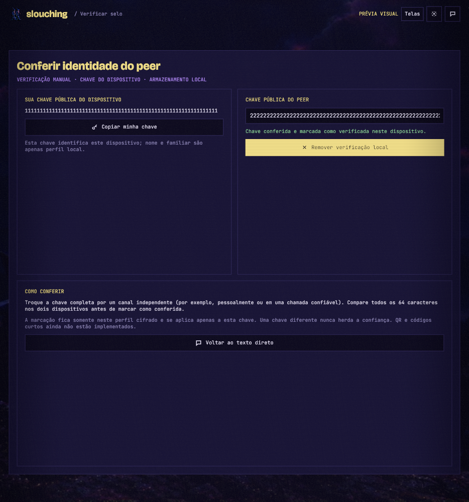
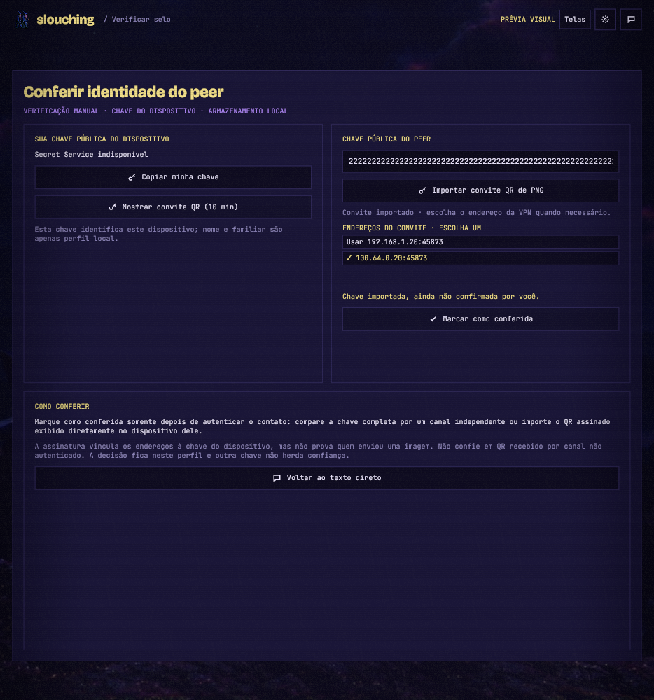
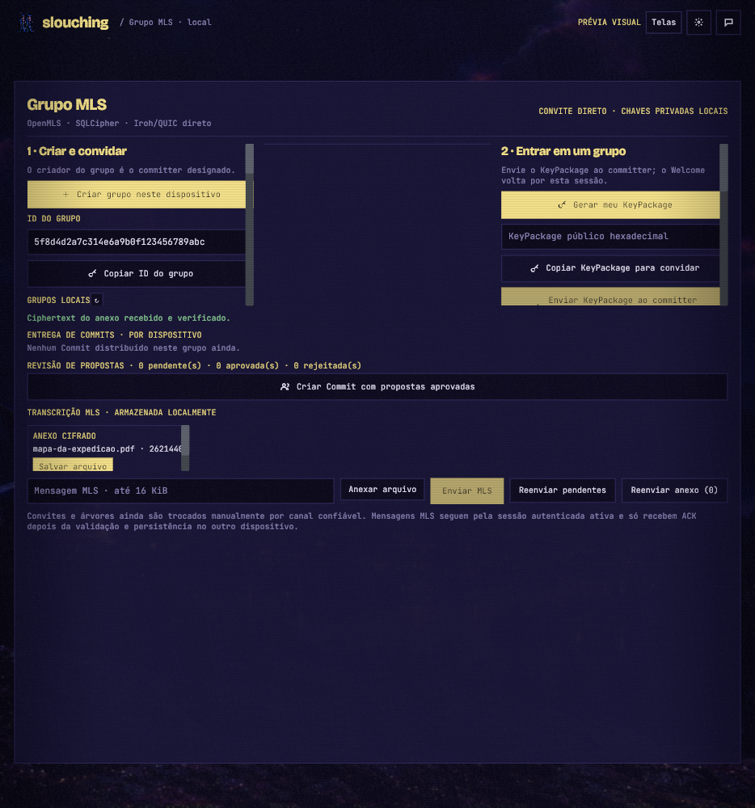
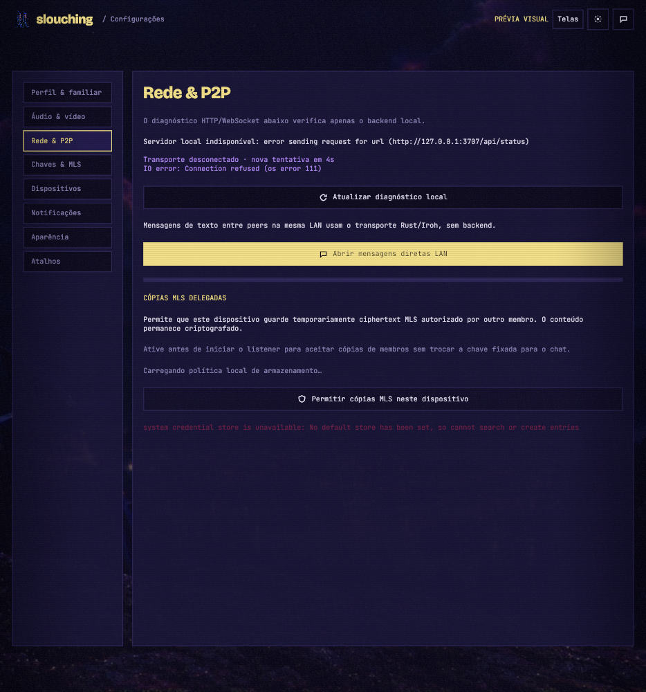
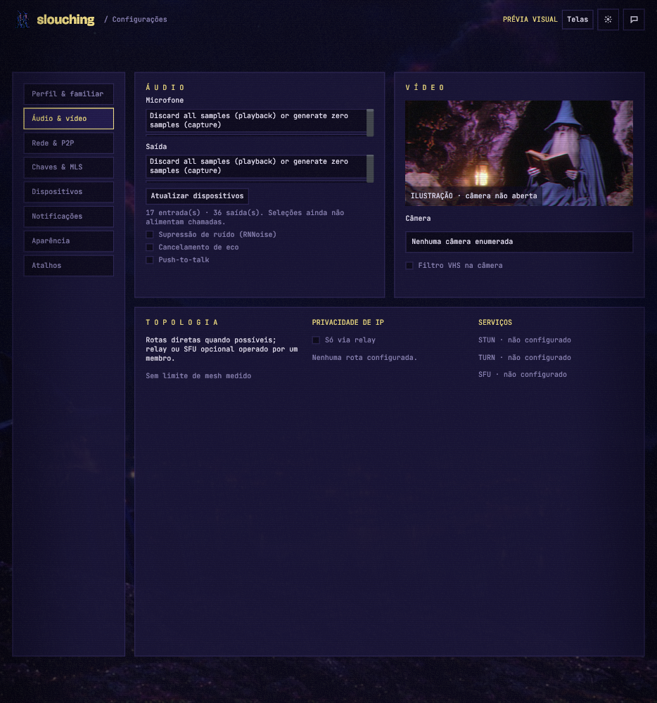

# Slouching frontend

Slouching's product client is a **native Rust/Iced desktop app**. This
follows the owner's [complete architecture PDF](https://github.com/slouching-org/slouching-backend/blob/main/docs/fichas/architecture/sources/architecture-p2p-v0.1.pdf);
the current architecture keeps Elixir as the server/backend core and Rust/Iced
as the client. The Rust peer scaffold is historical work, not this client's
backend interface.

The first HTML/CSS/JavaScript screens were a rushed **visual prototype**.
They now live in [`prototypes/web/`](prototypes/web/) and are not the
product frontend. The Rust app in [`src/main.rs`](src/main.rs) is the
application entry point; [src/ui.rs](src/ui.rs) owns the native design components and screens.

## Run the native scaffold

```sh
cargo check
cargo run
```

The build uses `protoc` to generate Rust types from
[`proto/slouching/v1/handshake.proto`](proto/slouching/v1/handshake.proto),
the copied shared protocol schema.

The app makes an asynchronous development handshake to
`GET http://127.0.0.1:3707/api/status` when it opens and on **Refresh backend**.
Run the sibling Elixir backend locally to see a response; otherwise the UI
reports it as unavailable. A response must match status contract v1 and
`backend: "elixir_scaffold"`. The UI reports contract mismatches separately.
This diagnostic confirms only that the local backend process responds. It
does not authenticate peers, start messaging, or establish a secure network
connection.

The native client has an internal file-transfer crypto foundation: random
per-file keys, authenticated 48 KiB chunks, a 100 MiB size bound, ciphertext
digests, bounded streaming encryption/decryption, and a filename-only offer
format. The app has a private per-user encrypted blob-store location and a
streaming ciphertext import that checks exact length and digest before adding
a persistent reference. A stored blob can be decrypted chunk by chunk to a
user-selected path; publication waits for AEAD and ciphertext-digest checks and
never replaces an existing file. On Unix, plaintext staging files use mode
0600. Encrypted blobs can be fetched over Iroh QUIC;
the provider handler requires explicit peer authorization. A separate
unidirectional QUIC stream helper transfers ciphertext against an expected
group-bound offer, with a two-endpoint test that saves the received file. The
The SQLCipher profile stores and reloads each group-bound offer, content key,
sender key, and ciphertext digest. Storage checks the author against active
MLS membership and verified device bindings, rejects quarantined groups and
conflicting transfer IDs, and rechecks the group epoch before inserting. A
200 MiB per-profile attachment quota is enforced before storing an offer; the
schema migration backfills sizes from existing offers. OpenMLS authenticates
and decrypts the bounded attachment envelope before its manifest is committed
with the ratchet, event, and transcript; ACK follows that transaction. Exact
redelivery is deduplicated, and outbound offers are committed with the sender's
ratchet and retryable outbox event.

The MLS composer imports and encrypts a selected file, sends its offer as an
MLS application event, then starts a separate QUIC ciphertext stream after the
receiver ACKs that event. The receiver checks the connected device's MLS group
membership and exact stored offer before importing the bounded ciphertext
stream. History renders attachment cards; **Salvar arquivo** decrypts to a
user-selected path and publishes only after digest validation. A failed
outbound stream can be retried from the MLS screen while the app remains open.
Two-endpoint tests cover stream transfer and save, but the full
database-authorized desktop flow and cross-machine file transfer still need
runtime validation. The pinned iroh-blobs 0.103.1 release is marked by its
maintainers as not production quality, so this path remains experimental.

The app also opens `ws://127.0.0.1:3707/ws` asynchronously, sends a binary
protobuf `ClientHello` v1, and validates one binary `ServerHello` or
`VersionError` response. A compatible development transport stays open with
WebSocket Ping/Pong heartbeats and reconnects after a disconnect. This does
not establish a peer session. The UI shows connection and protocol errors
separately. **Refresh backend** repeats both
the HTTP diagnostic and WebSocket handshake.

## Direct peer messages

The **chat** button in the Iced app opens a persistent direct-text screen. This
path sends real text over Iroh/QUIC between devices on a reachable UDP route; it is
separate from the Elixir diagnostics and has no hosted service in the data
path.

1. Start the app on both devices and create a device identity if needed. On
   Linux, the system Secret Service must be available to create or load it.
2. On each device, open **Conferir identidade do peer → Mostrar convite QR**.
   Capture the displayed QR as a PNG, transfer that image through a channel
   you trust, and import it on the other device with **Importar convite QR de
   PNG**. Repeat in the other direction. This exchanges public keys; importing
   alone does not mark a contact verified. Live camera scanning is not part of
   this version.
3. On the intended listener, choose a UDP port (for example `45873`) and click
   **Aguardar peer**. Open the verification screen again and show a fresh QR;
   while listening, it includes the announced addresses and expires in 10
   minutes. Capture and transfer that PNG to the initiator. On import, choose
   the address that is reachable from the initiator's network; the app keeps
   all addresses from the invite available as choices.
4. Optionally configure the same participant-operated relay URL and shared
   token in **Relay do grupo** on both devices, then save it before sending.
   On the initiator, enter the listener's address if it was not imported, type a
   message, and click **Conectar e enviar**. After connection, either device
   can send multiple messages over the same session. Sent text appears only
   after an ACK; received text appears live after the pinned identity check.
   The connected status confirms an authenticated session; it does not claim
   that the route avoided the configured relay.

For a VPN test, use the listener's VPN interface address (not its Wi-Fi or
public address), keep the listener's UDP port, and allow inbound UDP on that
port in the listener's firewall. The VPN must route UDP between both devices.
If the app reports a timeout, the route is not established; this screen does
not perform NAT traversal. The flow is implemented for reachable socket
addresses, but a VPN connection between separate machines remains unverified.
The invite format, signature, limits, and trust boundary are documented in the
[project's v1 invite spec](https://github.com/slouching-org/slouching/blob/main/docs/fichas/identity/pairing-invite-v1.md).

A successful connection saves the pinned device key and its direct socket or
relay-only route in the encrypted local route book. The chat screen lists these
routes, and MLS fan-out can use the saved route plus the configured relay to
retry pending Commits and messages. LAN addresses can become stale; peers
without a saved route remain pending. Relay-assisted MLS fan-out is implemented
but has not yet had a separate end-to-end test. The listener stays
available through the session. Either side can use **Desconectar sessão** to
close it; start a new session to reconnect. The
receiver saves an inbound message to its encrypted local history before ACK;
the sender saves an outbound message after receiving ACK. ACK confirms
acceptance into the receiver's local transcript, not that the user read it.
History stays on each device and is scoped to the pinned peer key; it is not
synchronized. **Apagar histórico local deste peer** removes only that peer's
rows after an explicit confirmation. This is pairwise QUIC channel encryption
and the pinned device key, not MLS messaging or human identity verification. Direct
addresses are still exchanged manually; there is no automatic discovery,
hole-punching, offline delivery, or media. With a saved relay, a blank peer
address uses that relay, while a supplied address lets Iroh try the direct
route and relay fallback. Relay URL and token are stored in the encrypted
local profile. The relay carries encrypted QUIC traffic and can observe
connection metadata; it is operated by a group member, not provided by
Slouching. Remote relays must use HTTPS and require the same shared token on
all members. The local integration test starts an authenticated Iroh Relay
1.3 server and confirms a pinned text message, opaque MLS event, and their
ACKs with no direct peer address; this tests transport, not MLS cryptography;
remote TLS deployment and cross-network behavior have not yet been verified.

If both devices use the same VPN, they can also try the direct flow now: enter
the receiver's VPN address and allow the chosen UDP port through the VPN and
local firewalls. The VPN must carry UDP between the devices. This has not yet
been tested between physical machines. The automated
`cargo test --test peer_process` launches separate OS processes, exchanges
multiple messages in both directions over one connection, checks wrong-pin
rejection, and verifies a pending send is reported as unknown on disconnect.

## Direct voice call with another device

Voice calls are ready for the first physical-device trial, but have only been
verified with two local WebRTC peers so far. Both devices need an active,
manually pinned direct peer session and membership in the **same dedicated call
MLS group**.

1. On one device, open **Chamada**, create a protected call group, then use
   **Convidar participantes** to admit the other device through the MLS flow.
   Complete the Welcome on the other device and confirm both screens show the
   same call group.
2. On each device, open **Configurações → Áudio & vídeo**. Choose a microphone
   and speaker, then use **Testar microfone localmente** to confirm capture.
3. On the caller, return to **Chamada** and click **Negociar WebRTC**. The other
   device shows **Chamada de voz recebida**; accept to connect or decline to
   refuse. The app opens the microphone only after acceptance and WebRTC
   connects. **Silenciar microfone** stops outgoing voice frames; **Leave** ends
   the call.

Voice uses direct WebRTC host candidates over UDP. The manually selected UDP
port in **Texto direto** carries QUIC signaling; WebRTC also chooses its own
UDP port dynamically. Allow the app's UDP traffic through both device firewalls
and the VPN, and make sure the VPN routes between the peers. No STUN/TURN or
NAT traversal is configured, so this will fail if the VPN or firewall blocks
the advertised route. Video, calls over a deployed relay, and calls between
physical devices have not yet been validated.

Before trusting a peer's identity, open **Conferir identidade do peer** from
the shield button, exchange the complete 64-character device keys through a
separate channel and compare every character, or import a signed QR shown
directly by the intended contact. The QR binds its addresses to the device
key, but does not prove the person behind a transferred image. Import never
marks trust automatically; press **Marcar como conferida** only after
authenticating the QR source. That decision is local to this encrypted profile
and exact key. It does not verify a display name, and a replacement key must be
verified again. Camera scanning and short verification codes are not available.

To operate a relay, run the Iroh Relay `1.3.0` server on a host the group
controls, configure HTTPS and `access.shared_token`, and enter that HTTPS URL
and token on every participating device. The app does not silently use a
public relay. A group member must provide DNS, TLS, uptime, and network access
for the relay host.

### Delegated MLS copy helper

The opt-in in **Settings → Rede & P2P** must be enabled before starting
**Aguardar peer**. In this mode the listener accepts authenticated devices one
session at a time, so an author can store a signed ciphertext copy and a
different recipient can reconnect later to fetch it. Other application frames
still require the manually pinned peer. This is store-and-forward only: the
author, helper, and recipient still need a reachable route to the helper when
each session is made. The saved participant-operated relay can provide that
route, but the helper flow has not yet been exercised over a remote relay.

The native app now recreates all eleven design-board views with real Iced
widgets, original characters and scenery, extracted outline SVG icons,
Bricolage Grotesque and JetBrains Mono, translucent panels, scanlines, and
vignette. The top-right **Telas** button opens the screen gallery.

An additional **Grupo MLS** screen supports two-device group setup. Create the
group on one device and share its ID. The invitee can send its public KeyPackage
over the active pinned session, or copy it through a trusted channel. The
committer reviews and admits the package; the receiver checks that its device
key matches the pinned peer before saving the Commit. After admission, the committer sends the Welcome and ratchet tree through the
same pinned session. The committer saves the exact Welcome bundle in its
encrypted outbox with the membership Commit. The invitee validates it and
stores the group before ACK; the same content-bound event is recorded in that
transaction, so a retry after a lost ACK safely returns the existing group.
After an unknown delivery or app restart, reconnect to the pinned invitee to
retry the queued bundle. Copy/paste fields remain available if direct delivery
is unavailable. After both devices join, open
**Texto direto · LAN/VPN** and connect them using the usual
pinned-key and reachable-address flow. In **Grupo MLS**, select the same group ID on
both devices; MLS messages are encrypted and sent over that active direct
Iroh/QUIC session. The receiver validates the MLS event and stores its
ciphertext, ratchet update, and plaintext transcript in SQLCipher before
sending the transport ACK. Each message atomically snapshots this epoch's peer
devices with the ciphertext and ratchet update. The sender records ACKs per
device and leaves other recipients queued; the outbox event closes only after
all snapshot members confirm. Direct send checks that the pinned peer belongs
to the snapshot. The MLS screen can retry messages for the connected peer or
distribute them to all peers with saved routes. A peer with pending Commits is
skipped until its group epoch is current; unavailable peers remain queued. New
MLS chat events expire after 30 days. Expired events leave the retry queue,
recipients reject new expired events before changing their MLS ratchet, and
fan-out status reports the number that expired during the run.
Membership Commits are also saved atomically with the
group epoch in a separate local outbox; the latest pending Commit is restored
from SQLCipher and can be sent from the MLS screen over an active direct
session. The sender matches the pinned peer key to the device snapshot taken
at the Commit's predecessor epoch; a newly invited device is not sent that
older Commit, while a removed device can still receive its removal Commit.
The recipient validates it and persists the new
epoch before ACK, and the sender stores that ACK per recipient. Exact redelivery
is harmless. When a pinned peer connects, the client checks for that device's
eligible Commit chain and starts delivery automatically; each next Commit waits
for the preceding durable ACK. The manual **Enviar Commits pendentes** control
remains available for the connected peer. **Distribuir a todos os peers salvos**
walks the queued recipient ledger, connects to each peer's saved route in turn,
and sends its eligible Commits in bounded batches. Each Commit waits for its
durable ACK before the next is sent; one unavailable peer does not stop delivery
to the others. Stop the current listener/session before starting the fan-out.
Stale or missing routes are reported and can be retried after reconnecting.
Offline delivery remains in progress. If a recipient is behind, it requests the missing predecessor over
the pinned session; the committer serves it only when that device was in the
Commit's predecessor snapshot, including Commits already marked delivered.
The MLS screen
shows each eligible device's persisted adoption ACK. Storage regression tests
build a two-Commit chain, verify epoch order, and confirm that the next Commit
remains queued after the first recipient ACK and a database reopen. New members join with the matching Welcome and ratchet tree delivered over the
pinned session after the committer admits their KeyPackage. The transcript reloads locally, and **Reenviar pendentes**
sends queued events for the selected group after reconnecting.

The local SQLCipher database also contains a disabled-by-default storage
primitive for delegated MLS ciphertext. Its signed grants bind one event to
one target device; it enforces holder quota and finite expiry, and clears a
stored copy after recipient ACK. The native UI and peer transport do not yet
expose this feature, so the current message path still requires a reachable
group member.

### Testar fan-out MLS com três dispositivos

Use três máquinas na mesma LAN (A, B e C). Em cada uma, crie uma identidade e
troque as chaves públicas por um canal confiável. Libere no firewall UDP para a
porta escolhida em cada máquina.

1. Em A, crie um grupo MLS. Em B, conecte a A usando o endereço LAN anunciado e
   envie o KeyPackage público. Em A, admita B e envie o Welcome. Confirme que B
   abriu o mesmo grupo.
2. Repita com C. C recebe o Welcome no epoch atual; B precisa aplicar o Commit
   que adicionou C.
3. Faça A conectar uma vez a B e uma vez a C usando as chaves pinadas e os
   endereços LAN deles. Isso salva as duas rotas no dispositivo A. Encerre a
   sessão/listener e, em A, clique em **Distribuir a todos os peers salvos**
   para entregar a B os Commits pendentes.
4. Confirme que os três dispositivos mostram o mesmo grupo e epoch. Em A,
   envie uma mensagem MLS e clique em **Distribuir mensagens MLS aos peers
   salvos**. B e C devem mostrar a mensagem recebida. Em A, o status deve
   confirmar ACK de ambos e a outbox só deve fechar depois dos dois ACKs.
5. Para conferir a retomada, feche ou desconecte C antes do próximo fan-out.
   B deve receber e confirmar a mensagem; C deve continuar pendente. Reconecte
   A a C para atualizar a rota, feche a sessão e repita o fan-out. C deve
   receber o mesmo evento, sem duplicar a mensagem em B.

Esse fluxo exercita rotas diretas salvas e ACK por membro; não usa Postgres nem
helper. Uma rota inacessível fica pendente, e o ACK confirma persistência no
cliente remoto, não leitura humana.

The MLS screen lists groups saved in the local SQLCipher database with their
current epoch and quarantine state. **Abrir** restores a group's ID, bounded
transcript, pending Commits, and security alert, so reopening the app does not
depend on remembering the group ID.

A member can create a signed MLS self-update proposal and send it to the
designated committer over the active pinned peer session, or copy its public
bytes for a separately trusted channel. The committer checks that the MLS
author is the same device as the pinned transport peer, authenticates the
member's device-bound MLS credential, stores the proposal in the encrypted
OpenMLS state, and deduplicates exact redelivery. The sender receives an ACK
only after the proposal is stored. Only the designated committer can turn
individually approved proposals into a Commit. Each proposal starts pending;
the committer can explicitly approve or reject it, and the selection is stored
in the encrypted profile. The OpenMLS Commit builder includes only approved
proposal references and consumes the epoch's remaining proposal queue when the
Commit advances the group. Rejected proposals are not included. That operation saves the new epoch, Commit
outbox, and predecessor-member recipient ledger atomically; the existing
direct-session Commit delivery flow distributes it. This proposal path accepts
self-updates only. Before Commit creation, the committer screen lists each
authenticated proposal's epoch, member key prefix, proposal ID prefix, and
review state. Other proposal types are not implemented.

For this flow, both members join the same group. The member opens it, clicks
**Criar proposta para atualizar minha chave**, connects directly to the
designated committer, and clicks **Enviar proposta ao committer conectado**.
The copy/paste controls remain available when the devices cannot connect. The
committer then clicks **Criar Commit das propostas pendentes** and distributes
it over the active pinned peer session.

Before applying a Commit, each device saves the prior OpenMLS epoch state in
its encrypted profile database. If it later receives a different, valid Commit
from the designated committer for an already accepted predecessor epoch, it
verifies that Commit against the saved state, records both signed Commit values,
and quarantines the group locally. The accepted epoch remains unchanged, and
the UI shows a persistent security alert while blocking MLS sends, retries,
and further Commit distribution for that group. Invalid Commit bytes do not
quarantine the group. This client currently has no automated recovery or rekey
flow for a quarantined group.

Familiar selection, invitation/draft fields, screen navigation, settings
tabs, illustrative share-source selection, and interface texture work locally.
The familiar screen saves the display name and familiar as a local profile in
SQLCipher encrypted SQLite; the database key is stored in the operating system
credential store. Saving fails closed when that store is unavailable. The
screen can also explicitly create and retain an Ed25519 device signing key in
the system credential store. The direct-text trust screen creates a signed
10-minute QR invitation containing the public key and optional listener
addresses, then imports it from PNG and lets the user choose a route. The QR
does not auto-verify human identity; a changed key has no inherited trust.
Camera scanning, short verification codes, and contact discovery are not
implemented. OpenMLS credentials
include a versioned binding signed by the durable device key. One-use
KeyPackages and private MLS state are stored in SQLCipher. The direct-chat
screen separately pins device public keys. Character scenes remain visual
previews. **Áudio & vídeo** enumerates real audio inputs and outputs, and lets
the user choose a device for the current app session. The explicit
**Testar microfone localmente** action opens the selected input and shows an
RMS level meter; samples stay in the audio callback and are neither saved nor
sent. The test stops when the user leaves the audio tab or screen.
The client now has an isolated SFrame frame-protection module with per-member,
epoch-bound key IDs, a fresh random session context, bounded frames, and replay
rejection. It requires key material supplied by a call MLS exporter, which is
now available from a separately typed call MLS group. The call purpose is
persisted in SQLCipher and carried by the authenticated Welcome; conversation
groups cannot export media keys. The SFrame sender takes its local leaf index
from the authenticated call group; a receiver resolves the sender device key
to that group's current leaf index. A two-device Welcome test checks distinct
member indexes and encrypts/decrypts a frame with the shared MLS exporter. This
WebRTC now carries mono 48 kHz/20 ms Opus tracks inside SFrame over RTP. The
offer and answer use gathered host ICE candidates, and call signaling remains
on the pinned QUIC session. Incoming offers now show the pinned peer and wait
for an explicit accept or decline before WebRTC/media setup. The selected
microphone starts after acceptance and ICE/DTLS connection; decoded,
authenticated frames go to the selected output device. The
test suite negotiates two local WebRTC peers, sends an Opus/SFrame frame over
RTP, and verifies decoded samples reach the remote sink. This validates the
local media path, not audio-device behavior between physical computers. Calls
require both devices to be members of the same dedicated call MLS group, and
each must select a microphone and output in Settings. The call screen's
microphone control silences outgoing frames locally. The screen chooser
enumerates monitors and captures a still preview on demand without sending it to
a peer. Continuous screen capture, H.264 encoding, protected video RTP, remote
video rendering, camera capture, noise suppression, echo cancellation, and
push-to-talk are still inactive.
**Rede & P2P** in Settings retains
the Elixir HTTP/WebSocket diagnostics and manual refresh. On Linux, this uses
Secret Service, so a desktop password vault must
be installed and available in the user session.













The Network and P2P settings expose persisted opt-in for delegated encrypted
MLS copies, with the local quota and expiry policy beside the control. QUIC v10
transports signed author grants and lets a reconnecting recipient fetch up to
16 authorized copies per connection. When direct delivery fails, the MLS
fan-out action tries a reachable routed group member that opted in. The helper
ACK stays separate from recipient delivery; the author's outbox remains
queued until the target device accepts the event. Helper retention is
best-effort within the configured quota and expiry.
Turning off consent erases every queued ciphertext copy from that device.

The MLS screen now detects authenticated committer equivocation. It verifies a
conflicting historical Commit against a saved OpenMLS epoch snapshot, stores
both Commit values in the encrypted database, and quarantines that group on
the device. Its accepted epoch remains intact, and reopening the group restores
the visible security alert. MLS message creation, event retries, member admission,
and Commit delivery or manual application are blocked until a recovery or rekey
flow is implemented. Regression coverage runs an exact redelivery and valid
conflict simultaneously through two independent SQLite connections; the group
ends quarantined at its accepted epoch without a transient lock failure.

The eleven design-board views and additional MLS screen are captured in [native-vhs](docs/design/runtime/native-vhs/).
These are a first implementation of the visual direction, with comparison
at 1280 × 800 and a compact 960 × 640 window. Exact visual parity and
accessibility remain to be completed; the local Opus/SFrame RTP media path is
implemented, while physical-device calls still need validation.
The current direct transport, delegated-copy frames, call-group Welcome purpose,
and bounded call-signaling frames are specified in the [v10 peer protocol](docs/fichas/transport/lan-peer-v10.md). Version 9 remains as the prior compatibility contract.

## Reproduce native captures

```sh
cargo run -- --screen 09-home
SLOUCHING_WINDOW_SIZE=1280x800 cargo run -- --capture-dir /tmp/slouching-captures
SLOUCHING_WINDOW_SIZE=960x640 cargo run -- --capture-dir /tmp/slouching-captures --capture-screen 01-familiar
SLOUCHING_WINDOW_SIZE=1280x800 cargo run -- --capture-dir /tmp/slouching-captures --capture-screen 06-chat --capture-peer-addresses
SLOUCHING_WINDOW_SIZE=1280x800 cargo run -- --capture-dir /tmp/slouching-captures --capture-screen 11-mls --capture-mls-review
SLOUCHING_WINDOW_SIZE=1280x800 cargo run -- --capture-dir /tmp/slouching-captures --capture-screen 11-mls --capture-mls-attachment
SLOUCHING_WINDOW_SIZE=1280x800 cargo run -- --capture-dir /tmp/slouching-captures --capture-screen 02-settings --settings-tab 1
SLOUCHING_WINDOW_SIZE=1280x800 cargo run -- --capture-dir /tmp/slouching-captures --capture-screen 08-verify --capture-peer-verification
SLOUCHING_WINDOW_SIZE=1280x800 cargo run -- --capture-dir /tmp/slouching-captures --capture-screen 08-verify --capture-peer-invite
SLOUCHING_WINDOW_SIZE=1280x800 cargo run -- --capture-dir /tmp/slouching-captures --capture-screen 08-verify --capture-peer-invite-imported
SLOUCHING_WINDOW_SIZE=1280x800 cargo run -- --capture-dir /tmp/slouching-captures --capture-screen 10-call --capture-call-negotiation
```

The capture command renders all twelve screens, saves screenshots through
Iced's window screenshot API, and exits. Add `--capture-screen <slug>` to
capture one view, such as the familiar screen, instead of the full gallery. A tiling compositor may override
the requested window size; float/resize that window before the capture delay.
Set `SLOUCHING_CAPTURE_DELAY_MS` to extend the default six-second delay when
needed. `--capture-peer-addresses` supplies illustrative LAN and VPN socket
addresses for the direct-chat capture; they are fixtures, not live interfaces.
`SLOUCHING_WINDOW_SIZE` only requests an initial size. The normal
default is a compact 1100 × 720 window.
`--capture-mls-review` adds sample pending, approved, and rejected proposals to
illustrate the review controls; they are fixtures, not live MLS state.
`--capture-mls-attachment` adds a sample attachment card and connected state;
they are fixtures, not a transferred file or live peer session.
The audio-settings capture uses real device enumeration from the current
session; device names vary by machine. Selected devices feed live call capture
and playback, but not this illustrative capture.
`--capture-peer-verification` supplies sample local and peer keys for the trust
screen capture; they are fixtures, not identities from the keyring.
`--capture-peer-invite` supplies a signed sample invitation and renders its QR
in the identity screen; its keys and address are fixtures.
`--capture-peer-invite-imported` shows the selectable LAN and VPN addresses
after QR import; all values are fixtures.
`--capture-call-negotiation` shows call controls with sample identity, peer, and
group values; they do not represent a live MLS group or WebRTC session.
The protected-audio update could not refresh `10-call.png` in this headless
environment: Iced/winit requires `WAYLAND_DISPLAY`, `WAYLAND_SOCKET`, or
`DISPLAY`. Run the capture command in a graphical session to render the current
screen.

Assets and font license/provenance notes are in [assets/README.md](assets/README.md).

## Architecture

- **UI:** Rust 2024, Iced 0.14.0 (pinned), wgpu renderer.
- **Local client core:** Rust owns local identity, cryptography, encrypted
  storage, peer transport, and media. The encrypted display profile and
  explicit Ed25519 key storage plus initial opaque encrypted-event storage
  are implemented. A pinned-device Iroh/QUIC LAN text exchange is available
  from the Iced UI with a persistent bidirectional session and per-peer history
  in SQLCipher. MLS application messages use the direct pinned Iroh/QUIC session with a
  local SQLCipher transcript, predecessor-epoch recipient snapshot, per-device
  ACK ledger, and retryable outbox. Membership Commit bytes are
  atomically journaled with group state; ordered direct delivery, per-device
  ACKs, predecessor recovery, and sequential multi-member fan-out over saved
  pinned routes are available. Helper delivery, offline delivery, and media
  remain in progress.
- **Server/backend:** Elixir in
  [`slouching-org/slouching-backend`](https://github.com/slouching-org/slouching-backend).
- **Current boundary:** loopback HTTP status and binary protobuf WebSocket
  handshake v1 and persistent Ping/Pong for development diagnostics. Authenticated production transport
  and functional APIs remain open design work.
- **Source of truth:** implemented backend and client-core state for identity,
  delivery, connections, capture, and calls. The UI must never invent them.

Read the [technology ficha](docs/fichas/architecture/tech-stack.md),
[native-client ADR](docs/fichas/architecture/adr-0003-native-client.md),
and [current-slice ficha](docs/fichas/frontend/current-slice.md).
Original screen exports are in [`docs/design/screens/`](docs/design/screens/).

The old web preview can still be viewed for visual comparison:

```sh
cd prototypes/web
python3 -m http.server 3708 --bind 127.0.0.1
```

That server is a static prototype only. The backend's current loopback
`/api/status` route is a development diagnostic, not the planned
production UI/core API.
