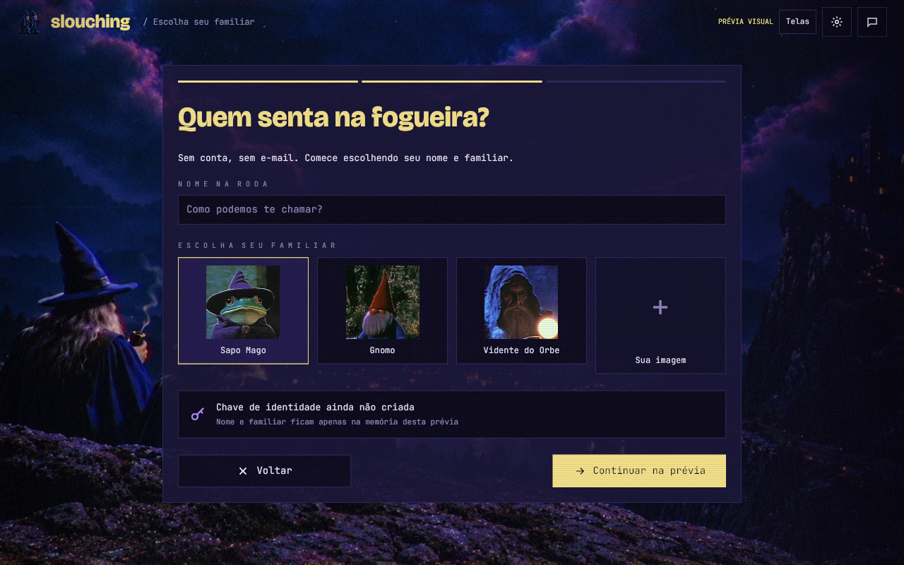
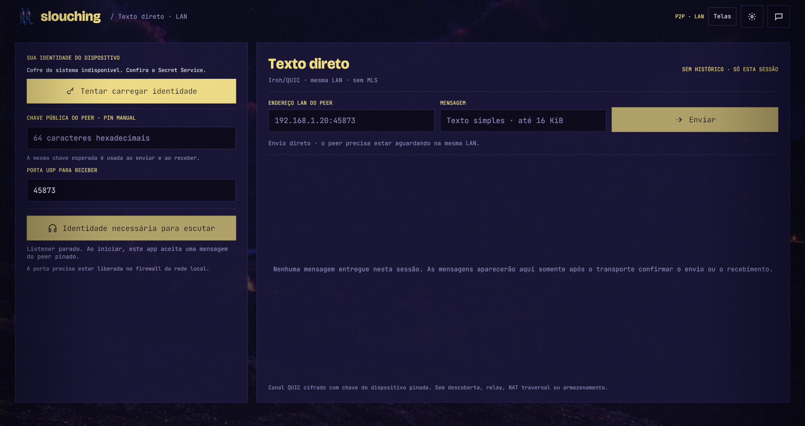
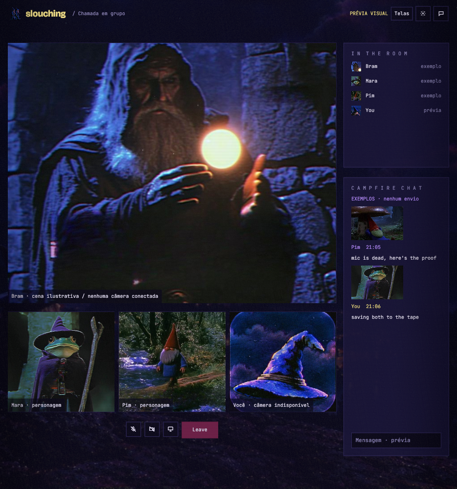
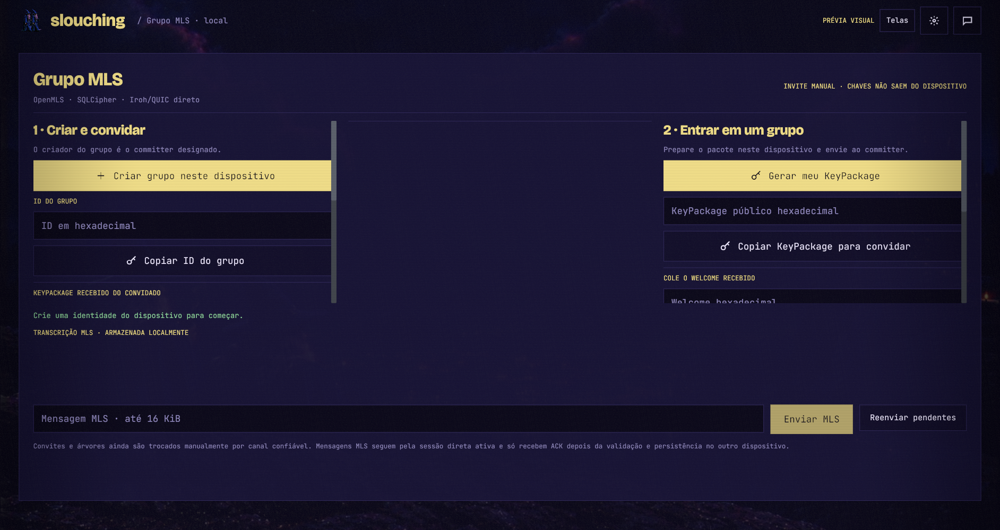

# Slouching frontend

Slouching's product client is a **native Rust/Iced desktop app**. This
follows the owner's [complete architecture PDF](https://github.com/slouching-org/slouching-backend/blob/main/docs/fichas/architecture/sources/architecture-p2p-v0.1.pdf);
the current architecture keeps Elixir as the server/backend core and Rust/Iced
as the client. The Rust peer scaffold is historical work, not this client's
backend interface.

The first HTML/CSS/JavaScript screens were a rushed **visual prototype**.
They now live in [`prototypes/web/`](prototypes/web/) and are not the
product frontend. The Rust app in [`src/main.rs`](src/main.rs) is the
application entry point; [src/ui.rs](src/ui.rs) owns the native design components and screens.

## Run the native scaffold

```sh
cargo check
cargo run
```

The build uses `protoc` to generate Rust types from
[`proto/slouching/v1/handshake.proto`](proto/slouching/v1/handshake.proto),
the copied shared protocol schema.

The app makes an asynchronous development handshake to
`GET http://127.0.0.1:3707/api/status` when it opens and on **Refresh backend**.
Run the sibling Elixir backend locally to see a response; otherwise the UI
reports it as unavailable. A response must match status contract v1 and
`backend: "elixir_scaffold"`. The UI reports contract mismatches separately.
This diagnostic confirms only that the local backend process responds. It
does not authenticate peers, start messaging, or establish a secure network
connection.

The app also opens `ws://127.0.0.1:3707/ws` asynchronously, sends a binary
protobuf `ClientHello` v1, and validates one binary `ServerHello` or
`VersionError` response. A compatible development transport stays open with
WebSocket Ping/Pong heartbeats and reconnects after a disconnect. This does
not establish a peer session. The UI shows connection and protocol errors
separately. **Refresh backend** repeats both
the HTTP diagnostic and WebSocket handshake.

## Direct LAN messages

The **chat** button in the Iced app opens a persistent direct-text screen. This
path sends real text over Iroh/QUIC between devices on a reachable LAN; it is
separate from the Elixir diagnostics and has no hosted service in the data
path.

1. Start the app on both devices. Create a device identity if needed, open the
   chat screen, and use **Copiar minha chave pública** to exchange the two 64-character
   Ed25519 public keys out of band. On Linux, the system Secret Service must
   be available to create or load this identity.
2. On both devices, paste the other device's public key into **Chave pública do
   peer · pin manual**. This manually pins the peer for both sending and receiving.
3. On the receiving device, choose a UDP port (for example `45873`) and click
   **Aguardar peer**. Use **Copiar endereço LAN** to copy the announced socket
   address and share it with the sender. If the app lists several addresses,
   the button prefers a private IPv4 address. Wildcard addresses such as
   `0.0.0.0` cannot be shared; if no LAN address is announced, check the
   device's network interfaces.
4. On the sending device, enter the receiver's LAN address and port, type a
   message, and click **Conectar e enviar**. After connection, either device
   can send multiple messages over the same session. Sent text appears only
   after an ACK; received text appears live after the pinned identity check.

The listener stays available through the session. Either side can use
**Desconectar sessão** to close it; start a new session to reconnect. The
receiver saves an inbound message to its encrypted local history before ACK;
the sender saves an outbound message after receiving ACK. ACK confirms
acceptance into the receiver's local transcript, not that the user read it.
History stays on each device and is scoped to the pinned peer key; it is not
synchronized. **Apagar histórico local deste peer** removes only that peer's
rows after an explicit confirmation. This is pairwise QUIC channel encryption
and pinned device identity, not MLS messaging or contact verification. There
is no address discovery, relay, cross-NAT support, retry/offline delivery, or
media. Allow the chosen UDP port through each device's local firewall. The automated
`cargo test --test peer_process` launches separate OS processes, exchanges
multiple messages in both directions over one connection, checks wrong-pin
rejection, and verifies a pending send is reported as unknown on disconnect.

The native app now recreates all eleven design-board views with real Iced
widgets, original characters and scenery, extracted outline SVG icons,
Bricolage Grotesque and JetBrains Mono, translucent panels, scanlines, and
vignette. The top-right **Telas** button opens the screen gallery.

An additional **Grupo MLS** screen supports manual two-device group setup:
create the group on one device, exchange the invitee KeyPackage over a trusted
channel, then return the Welcome and ratchet tree to the joining device. After
both devices join, open **Texto direto · LAN** and connect them using the usual
pinned-key and LAN-address flow. In **Grupo MLS**, select the same group ID on
both devices; MLS messages are encrypted and sent over that active direct
Iroh/QUIC session. The receiver validates the MLS event and stores its
ciphertext, ratchet update, and plaintext transcript in SQLCipher before
sending the transport ACK. The sender marks the outbox event held by the peer
only after that ACK. The transcript reloads locally, and **Reenviar pendentes**
sends queued events for the selected group after reconnecting.

Familiar selection, invitation/draft fields, screen navigation, settings
tabs, illustrative share-source selection, and interface texture work locally.
The familiar screen saves the display name and familiar as a local profile in
SQLCipher encrypted SQLite; the database key is stored in the operating system
credential store. Saving fails closed when that store is unavailable. The
screen can also explicitly create and retain an Ed25519 device signing key in
the system credential store. It displays the public key as unverified; no
fingerprint format or contact pairing is implemented. OpenMLS credentials
include a versioned binding signed by the durable device key. One-use
KeyPackages and private MLS state are stored in SQLCipher. The direct-LAN
screen separately pins device public keys. Character scenes and call views
remain visual previews. No camera, microphone, or screen is captured. **Rede &
P2P** in Settings retains the Elixir HTTP/WebSocket diagnostics and manual
refresh. On Linux, this uses Secret Service, so a desktop password vault must
be installed and available in the user session.










The eleven design-board views and additional MLS screen are captured in [native-vhs](docs/design/runtime/native-vhs/).
These are a first implementation of the visual direction, with comparison
at 1280 × 800 and a compact 960 × 640 window. Exact visual parity,
accessibility, and live media integration remain to be completed.

## Reproduce native captures

```sh
cargo run -- --screen 09-home
SLOUCHING_WINDOW_SIZE=1280x800 cargo run -- --capture-dir /tmp/slouching-captures
SLOUCHING_WINDOW_SIZE=960x640 cargo run -- --capture-dir /tmp/slouching-captures --capture-screen 01-familiar
```

The capture command renders all twelve screens, saves screenshots through
Iced's window screenshot API, and exits. Add `--capture-screen <slug>` to
capture one view, such as the familiar screen, instead of the full gallery. A tiling compositor may override
the requested window size; float/resize that window before the capture delay.
Set `SLOUCHING_CAPTURE_DELAY_MS` to extend the default six-second delay when
needed. `SLOUCHING_WINDOW_SIZE` only requests an initial size. The normal
default is a compact 1100 × 720 window.

Assets and font license/provenance notes are in [assets/README.md](assets/README.md).

## Architecture

- **UI:** Rust 2024, Iced 0.14.0 (pinned), wgpu renderer.
- **Local client core:** Rust owns local identity, cryptography, encrypted
  storage, peer transport, and media. The encrypted display profile and
  explicit Ed25519 key storage plus initial opaque encrypted-event storage
  are implemented. A pinned-device Iroh/QUIC LAN text exchange is available
  from the Iced UI with a persistent bidirectional session and per-peer history
  in SQLCipher. Outbound MLS application encryption is atomically persisted in
  the event journal; transport delivery, UI exposure, and media remain unbuilt.
- **Server/backend:** Elixir in
  [`slouching-org/slouching-backend`](https://github.com/slouching-org/slouching-backend).
- **Current boundary:** loopback HTTP status and binary protobuf WebSocket
  handshake v1 and persistent Ping/Pong for development diagnostics. Authenticated production transport
  and functional APIs remain open design work.
- **Source of truth:** implemented backend and client-core state for identity,
  delivery, connections, capture, and calls. The UI must never invent them.

Read the [technology ficha](docs/fichas/architecture/tech-stack.md),
[native-client ADR](docs/fichas/architecture/adr-0003-native-client.md),
and [current-slice ficha](docs/fichas/frontend/current-slice.md).
Original screen exports are in [`docs/design/screens/`](docs/design/screens/).

The old web preview can still be viewed for visual comparison:

```sh
cd prototypes/web
python3 -m http.server 3708 --bind 127.0.0.1
```

That server is a static prototype only. The backend's current loopback
`/api/status` route is a development diagnostic, not the planned
production UI/core API.
