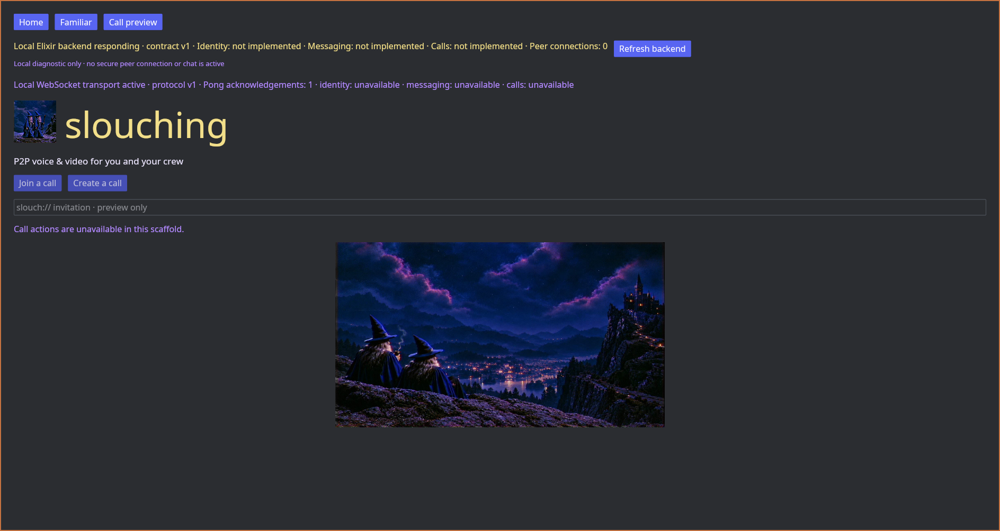

# Slouching frontend

Slouching's product client is a **native Rust/Iced desktop app**. This
follows the owner's [complete architecture PDF](https://github.com/slouching-org/slouching-backend/blob/main/docs/fichas/architecture/sources/architecture-p2p-v0.1.pdf);
the current architecture keeps Elixir as the server/backend core and Rust/Iced
as the client. The Rust peer scaffold is historical work, not this client's
backend interface.

The first HTML/CSS/JavaScript screens were a rushed **visual prototype**.
They now live in [`prototypes/web/`](prototypes/web/) and are not the
product frontend. The Rust app in [`src/main.rs`](src/main.rs) is the
new starting point.

## Run the native scaffold

```sh
cargo check
cargo run
```

The build uses `protoc` to generate Rust types from
[`proto/slouching/v1/handshake.proto`](proto/slouching/v1/handshake.proto),
the copied shared protocol schema.

The app makes an asynchronous development handshake to
`GET http://127.0.0.1:3707/api/status` when it opens and on **Refresh backend**.
Run the sibling Elixir backend locally to see a response; otherwise the UI
reports it as unavailable. A response must match status contract v1 and
`backend: "elixir_scaffold"`. The UI reports contract mismatches separately.
This diagnostic confirms only that the local backend process responds. It
does not authenticate peers, start messaging, or establish a secure network
connection.

The app also opens `ws://127.0.0.1:3707/ws` asynchronously, sends a binary
protobuf `ClientHello` v1, and validates one binary `ServerHello` or
`VersionError` response. A compatible development transport stays open with
WebSocket Ping/Pong heartbeats and reconnects after a disconnect. This does
not establish a peer session. The UI shows connection and protocol errors
separately. **Refresh backend** repeats both
the HTTP diagnostic and WebSocket handshake.

It opens home, familiar, and call-preview views using the supplied art.
Call and device controls are disabled. Invitation entry is a visual preview;
it does not connect peers, create keys, capture media, or send messages.
This is a native UI scaffold; visual parity with the eleven reference
screens and functional integration with the backend remain open work.



## Architecture

- **UI:** Rust 2024, Iced 0.14.0 (pinned), wgpu renderer.
- **Local client core:** Rust, with local identity, crypto, storage, transport,
  and media responsibilities from the source architecture; these remain unbuilt.
- **Server/backend:** Elixir in
  [`slouching-org/slouching-backend`](https://github.com/slouching-org/slouching-backend).
- **Current boundary:** loopback HTTP status and binary protobuf WebSocket
  handshake v1 and persistent Ping/Pong for development diagnostics. Authenticated production transport
  and functional APIs remain open design work.
- **Source of truth:** implemented backend and client-core state for identity,
  delivery, connections, capture, and calls. The UI must never invent them.

Read the [technology ficha](docs/fichas/architecture/tech-stack.md),
[native-client ADR](docs/fichas/architecture/adr-0003-native-client.md),
and [current-slice ficha](docs/fichas/frontend/current-slice.md).
Original screen exports are in [`docs/design/screens/`](docs/design/screens/).

The old web preview can still be viewed for visual comparison:

```sh
cd prototypes/web
python3 -m http.server 3708 --bind 127.0.0.1
```

That server is a static prototype only. The backend's current loopback
`/api/status` route is a development diagnostic, not the planned
production UI/core API.
